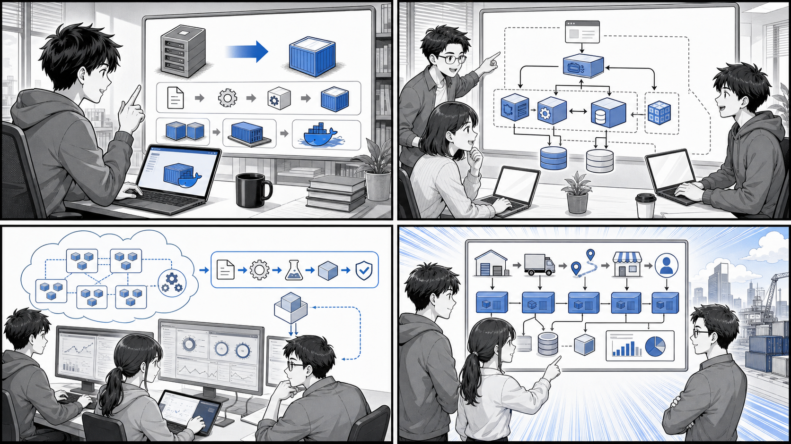

# Docker/Kubernetes 実践コンテナ解説

## はじめに

*Docker の基礎から Kubernetes、継続的デリバリー、ケーススタディまでを、手を動かしながら段階的に学びます。*

Docker と Kubernetes を使って、コンテナによるアプリケーションの開発・デプロイ・運用を実践的に学ぶシリーズです。

書籍『Docker/Kubernetes 実践コンテナ開発入門（第 2 版）』の章立てに沿って、コンテナの基礎から複数コンテナ構成、Kubernetes、継続的デリバリーまでを段階的に解説します。さらに、実在の業務システム（国際貨物輸送システム）の 4 アーキテクチャを題材に、Compose・Kustomize・Helm を比較するケーススタディを収録しています。各章は実際に動作するサンプルコード（[`apps/`](https://github.com/k2works/getting-started-docker-kubernetes/tree/main/apps)）に紐づいており、手を動かしながら理解できます。

## 章構成

### 第 1 部: コンテナと Docker

| 章 | テーマ |
|----|--------|
| [第 1 章 コンテナと Docker の基礎](getting-start-docker-kubernetes/01-container-and-docker-basics.md) | コンテナとは、Docker とは、利用意義、ローカル実行環境の構築 |
| [第 2 章 コンテナのデプロイ](getting-start-docker-kubernetes/02-container-deployment.md) | アプリの実行、イメージ作成、イメージ・コンテナの操作、Docker Compose |
| [第 3 章 実用的なコンテナの構築とデプロイ](getting-start-docker-kubernetes/03-practical-container-build-deploy.md) | 粒度、ポータビリティ、クレデンシャル、永続化データ |

### 第 2 部: 複数コンテナと Kubernetes 入門

| 章 | テーマ |
|----|--------|
| [第 4 章 複数コンテナ構成でのアプリケーション構築](getting-start-docker-kubernetes/04-multi-container-application.md) | Web/API/MySQL/マイグレータ/リバースプロキシ、Tilt |
| [第 5 章 Kubernetes 入門](getting-start-docker-kubernetes/05-kubernetes-introduction.md) | Pod/ReplicaSet/Deployment/Service/Ingress |
| [第 6 章 Kubernetes のデプロイ・クラスタ構築](getting-start-docker-kubernetes/06-kubernetes-deploy-cluster.md) | タスクアプリのデプロイ、インターネット公開 |

### 第 3 部: Kubernetes の実践

| 章 | テーマ |
|----|--------|
| [第 7 章 Kubernetes の発展的な利用](getting-start-docker-kubernetes/07-kubernetes-advanced.md) | デプロイ戦略、CronJob、RBAC |
| [第 8 章 Kubernetes アプリケーションのパッケージング](getting-start-docker-kubernetes/08-kubernetes-packaging.md) | Kustomize、Helm |
| [第 9 章 コンテナの運用](getting-start-docker-kubernetes/09-container-operations.md) | ロギング、可用性の高い運用 |

### 第 4 部: イメージ最適化と継続的デリバリー

| 章 | テーマ |
|----|--------|
| [第 10 章 最適なコンテナイメージ作成と運用](getting-start-docker-kubernetes/10-optimal-container-image.md) | 軽量ベースイメージ、Multi-stage builds、BuildKit、セキュリティ |
| [第 11 章 コンテナにおける継続的デリバリー](getting-start-docker-kubernetes/11-continuous-delivery.md) | Flux、Argo CD、PipeCD |
| [第 12 章 コンテナのさまざまな活用方法](getting-start-docker-kubernetes/12-container-use-cases.md) | 開発環境統一、CLI、負荷テスト |

### 第 5 部: 国際貨物輸送システムのケーススタディ

| 章 | テーマ |
|----|--------|
| [第 13 章 モノリスのデプロイ](getting-start-docker-kubernetes/13-case-monolith-compose-vs-kustomize.md) | Docker Compose 対 Kustomize |
| [第 14 章 イベント駆動マイクロサービスのデプロイ](getting-start-docker-kubernetes/14-case-event-driven-kustomize-vs-helm.md) | Kustomize 対 Helm |
| [第 15 章 ES/CQRS マイクロサービス（Axon）のデプロイ](getting-start-docker-kubernetes/15-case-escqrs-axon-kustomize-vs-helm.md) | Kustomize 対 Helm |
| [第 16 章 ES/CQRS マイクロサービス（Kafka）のデプロイ](getting-start-docker-kubernetes/16-case-escqrs-kafka-kustomize-vs-helm.md) | Kustomize 対 Helm |
| [第 17 章 ケーススタディ実装比較まとめ](getting-start-docker-kubernetes/17-case-comparison-summary.md) | 全アーキテクチャ × デプロイ手段の総括 |

### 付録

| 付録 | テーマ |
|------|--------|
| [付録 A 開発ツールのセットアップ](getting-start-docker-kubernetes/appendix-a-dev-tools-setup.md) | WSL2、asdf、kind、Rancher Desktop |
| [付録 B さまざまなコンテナオーケストレーション環境](getting-start-docker-kubernetes/appendix-b-orchestration-environments.md) | GKE、EKS、AKS、オンプレミス、ECS |
| [付録 C コンテナ開発・運用の Tips](getting-start-docker-kubernetes/appendix-c-tips.md) | コンテナランタイム、Kubernetes Tips、生成 AI 活用、apk |

## サンプルコード

各章のサンプルは [`apps/`](https://github.com/k2works/getting-started-docker-kubernetes/tree/main/apps) にあります（echo / taskapp / container-kit / image-bootstrap / ケーススタディ 4 種）。起動・デプロイのコマンドは [運用コマンドリファレンス](../operation/運用コマンドリファレンス.md) を参照してください。

## 執筆計画

本シリーズの執筆方針と章・ソースの対応は [執筆計画アウトライン](getting-start-docker-kubernetes/outline.md) を参照してください。

## 参考文献

- 『Docker/Kubernetes 実践コンテナ開発入門（第 2 版）』 — 山田明憲
